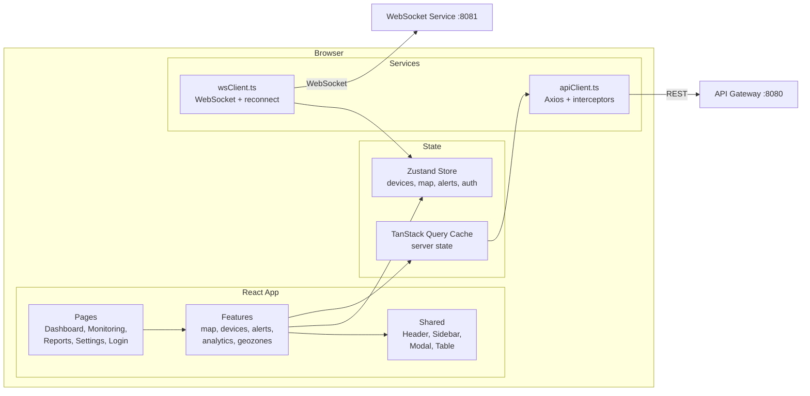
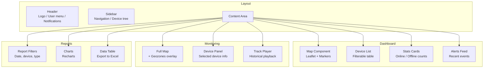
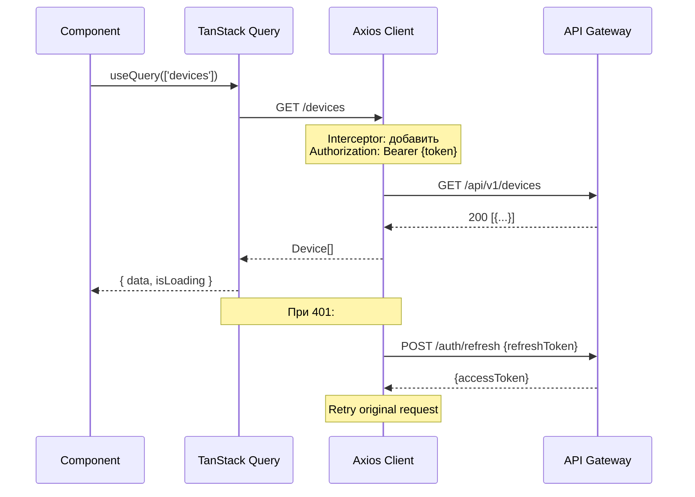
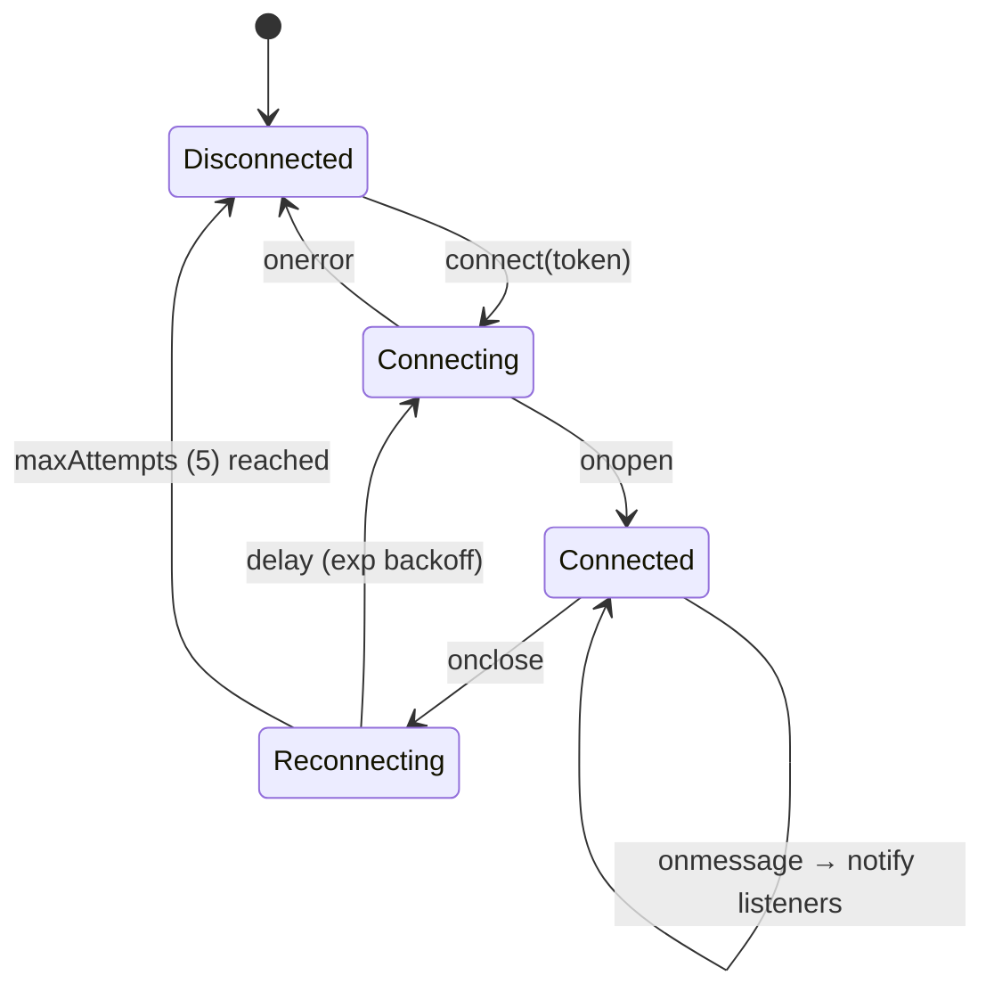
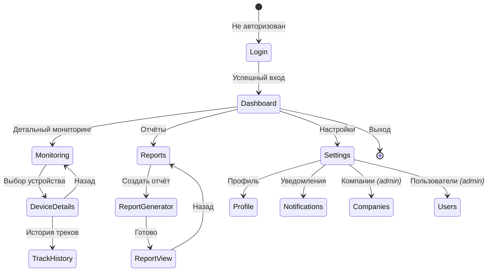

# 🗺️ Web Frontend — Архитектура

> Тег: `АКТУАЛЬНО` | Обновлён: `2026-06-02` | Версия: `1.0`

## Обзор

Single Page Application (SPA) на React 18 + TypeScript 5.
Feature-based архитектура с Zustand для глобального состояния,
TanStack Query для серверных данных, Leaflet для карты.

## Общая схема



## Структура проекта

```
src/
├── app/                    # Точка входа, провайдеры
│   ├── App.tsx             # Root component
│   ├── Router.tsx          # React Router v6 routes
│   └── providers/
│       ├── AuthProvider.tsx      # JWT auth context
│       ├── QueryProvider.tsx     # TanStack Query client
│       └── WebSocketProvider.tsx # WebSocket lifecycle
├── pages/                  # Страницы (роуты)
│   ├── Dashboard/
│   │   ├── Dashboard.tsx
│   │   ├── Dashboard.module.css
│   │   └── index.ts
│   ├── Monitoring/
│   ├── Reports/
│   ├── Settings/
│   └── Login/
├── features/               # Фичи (бизнес-логика)
│   ├── map/
│   │   ├── components/
│   │   │   ├── Map.tsx           # Leaflet карта
│   │   │   ├── DeviceMarker.tsx  # Маркер устройства
│   │   │   ├── GeozoneLayer.tsx  # Слой геозон
│   │   │   └── TrackLine.tsx     # Линия трека
│   │   ├── hooks/
│   │   │   ├── useMap.ts
│   │   │   └── useGeozones.ts
│   │   └── index.ts
│   ├── devices/
│   │   ├── components/
│   │   │   ├── DeviceList.tsx
│   │   │   ├── DeviceCard.tsx
│   │   │   └── DeviceDetails.tsx
│   │   ├── hooks/useDevices.ts
│   │   └── api/devicesApi.ts
│   ├── alerts/
│   ├── analytics/
│   └── geozones/
├── shared/                 # Переиспользуемые компоненты
│   ├── components/
│   │   ├── Header/
│   │   ├── Sidebar/
│   │   ├── Modal/
│   │   ├── DataTable/
│   │   ├── Button/
│   │   └── Input/
│   ├── hooks/
│   │   ├── useAuth.ts
│   │   ├── useWebSocket.ts
│   │   └── useLocalStorage.ts
│   └── utils/
│       ├── api.ts
│       ├── formatters.ts
│       └── validators.ts
├── store/                  # Zustand stores
│   ├── index.ts
│   ├── authStore.ts
│   ├── devicesStore.ts
│   ├── mapStore.ts
│   └── alertsStore.ts
├── services/               # API/WebSocket клиенты
│   ├── apiClient.ts
│   ├── wsClient.ts
│   └── authService.ts
├── types/                  # TypeScript типы
│   ├── api.ts
│   ├── device.ts
│   ├── geozone.ts
│   └── user.ts
└── styles/                 # Глобальные стили
    ├── global.css
    ├── variables.css
    └── themes/
```

## Компоненты экранов



## State Management

### Zustand Stores

```mermaid
flowchart LR
    subgraph "Zustand Stores"
        AS[authStore<br/>user, token, roles]
        DS[devicesStore<br/>devices Map, selectedId,<br/>filter]
        MS[mapStore<br/>center, zoom,<br/>visibleLayers, tracks]
        ALS[alertsStore<br/>alerts[], unreadCount]
    end

    subgraph "Data Sources"
        API[TanStack Query<br/>REST → devices, tracks]
        WS[WebSocket<br/>positions, alerts]
    end

    API -->|setDevices| DS
    WS -->|updatePosition| DS
    WS -->|addAlert| ALS
    API -->|setTrackHistory| MS
```

### devicesStore

```typescript
interface DevicesState {
  devices: Map<string, Device>;
  selectedDeviceId: string | null;
  filter: { search: string; status: string[] };

  setDevices: (devices: Device[]) => void;
  updatePosition: (position: DevicePosition) => void;
  selectDevice: (id: string | null) => void;
  setFilter: (filter: Partial<DevicesState['filter']>) => void;
}
```

### mapStore

```typescript
interface MapState {
  center: [number, number];
  zoom: number;
  visibleLayers: {
    devices: boolean;
    geozones: boolean;
    tracks: boolean;
    heatmap: boolean;
  };
  trackHistory: Map<string, DevicePosition[]>;

  setCenter: (lat: number, lon: number) => void;
  setZoom: (zoom: number) => void;
  toggleLayer: (layer: keyof MapState['visibleLayers']) => void;
  setTrackHistory: (deviceId: string, points: DevicePosition[]) => void;
}
```

### alertsStore

```typescript
interface AlertsState {
  alerts: Alert[];
  unreadCount: number;

  addAlert: (alert: Alert) => void;
  markAsRead: (id: string) => void;
  markAllAsRead: () => void;
  clearAlerts: () => void;
}
```

## API Client (Axios + Interceptors)



### TanStack Query Hooks

```typescript
// Все устройства (обновление каждые 60 сек)
const { data: devices } = useDevices();  // staleTime: 30s

// Трек устройства
const { data: track } = useDeviceTrack(deviceId, from, to);  // enabled: !!deviceId

// Dashboard (parallel queries)
const dashboard = useQueries({
  queries: [
    { queryKey: ['vehicles-summary'], queryFn: getVehicleSummary },
    { queryKey: ['alerts-summary'], queryFn: getAlertsSummary },
    { queryKey: ['geozone-summary'], queryFn: getGeozoneSummary },
    { queryKey: ['maintenance-summary'], queryFn: getMaintenanceSummary },
  ]
});
```

## WebSocket Client



### Reconnect стратегия

```
Попытка 1: задержка 1с
Попытка 2: задержка 2с
Попытка 3: задержка 4с
Попытка 4: задержка 8с
Попытка 5: задержка 16с
→ Показать пользователю «Соединение потеряно» и кнопку «Переподключить»
```

### WebSocket сообщения

```typescript
// Входящие
{ type: 'position', payload: { deviceId, lat, lon, speed, course, timestamp } }
{ type: 'alert', payload: { id, type, deviceId, message, timestamp } }
{ type: 'device_status', payload: { deviceId, status: 'online' | 'offline' } }
{ type: 'ping', payload: {} }

// Исходящие
{ type: 'subscribe', payload: { deviceIds: ['id1', 'id2'] } }
{ type: 'unsubscribe', payload: { deviceIds: ['id1'] } }
{ type: 'pong', payload: {} }
```

## Map Component (Leaflet)

### Ключевые компоненты

| Компонент | Назначение |
|-----------|-----------|
| `Map.tsx` | Инициализация Leaflet, tile layer (OSM) |
| `DeviceMarker.tsx` | Маркер с иконкой (green/gray/red по статусу) |
| `GeozoneLayer.tsx` | Polygon/Circle геозоны на карте |
| `TrackLine.tsx` | Polyline для истории маршрута |

### Оптимизация

- **Canvas renderer** — вместо SVG при >500 маркеров
- **Marker clustering** — `leaflet.markercluster` при >100 маркеров
- **Viewport filtering** — рендерить только маркеры в видимой области
- **Smooth position updates** — анимация перемещения маркера
- **Rotation** — `leaflet-rotatedmarker` для направления движения

## Навигация



## Технологический стек

| Категория | Технология | Версия | Назначение |
|-----------|------------|--------|-----------|
| Framework | React | 18.x | UI библиотека |
| Language | TypeScript | 5.x | Типизация |
| Build | Vite | 5.x | Сборка и dev server |
| Routing | React Router | 6.x | SPA навигация |
| State | Zustand | 4.x | Глобальное состояние |
| Data Fetching | TanStack Query | 5.x | Серверное состояние |
| HTTP | Axios | 1.x | HTTP клиент |
| Maps | Leaflet | 1.9.x | Карты |
| Charts | Recharts | 2.x | Графики |
| UI Kit | Shadcn/ui | latest | UI компоненты |
| Styling | Tailwind CSS | 3.x | Стили |
| Forms | React Hook Form | 7.x | Формы |
| Validation | Zod | 3.x | Валидация схем |
| Icons | Lucide React | latest | Иконки |
| Date | date-fns | 3.x | Работа с датами |
| Export | xlsx | latest | Экспорт в Excel |

## Docker (Production)

```dockerfile
# Multi-stage build
FROM node:20-alpine AS builder
WORKDIR /app
COPY package*.json ./
RUN npm ci
COPY . .
RUN npm run build

FROM nginx:alpine
COPY --from=builder /app/dist /usr/share/nginx/html
COPY docker/nginx.conf /etc/nginx/nginx.conf
EXPOSE 80
CMD ["nginx", "-g", "daemon off;"]
```

### nginx.conf (SPA routing)

```nginx
server {
    listen 80;
    root /usr/share/nginx/html;
    index index.html;

    # SPA: все пути → index.html
    location / {
        try_files $uri $uri/ /index.html;
    }

    # API proxy
    location /api/ {
        proxy_pass http://api-gateway:8080;
    }

    # WebSocket proxy
    location /ws/ {
        proxy_pass http://websocket-service:8081;
        proxy_http_version 1.1;
        proxy_set_header Upgrade $http_upgrade;
        proxy_set_header Connection "Upgrade";
    }

    # Статика: кеш 1 год (hashed filenames)
    location ~* \.(js|css|png|jpg|webp|svg|woff2)$ {
        expires 1y;
        add_header Cache-Control "public, immutable";
    }
}
```
